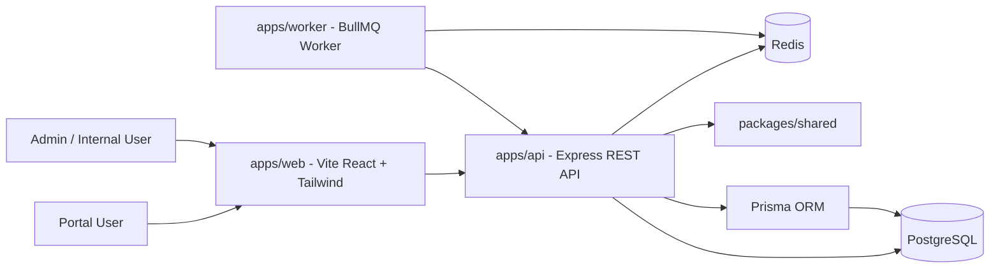
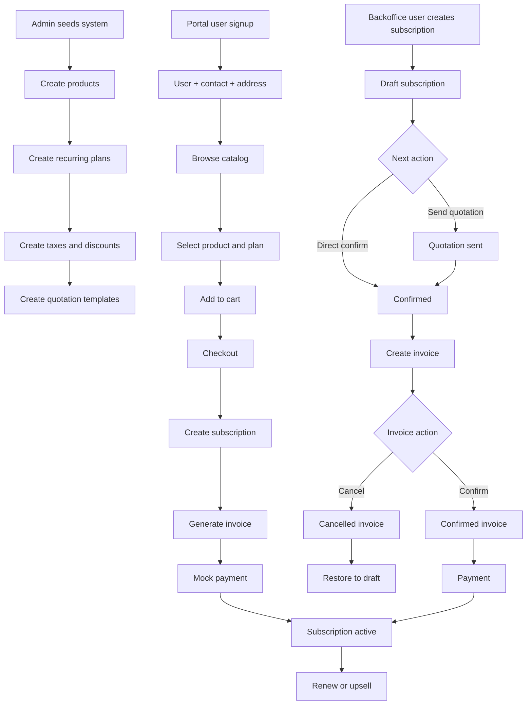
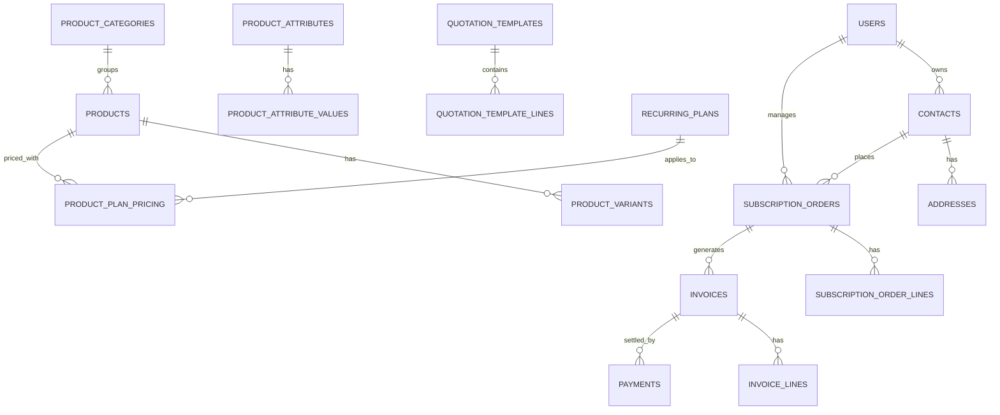

# Veltrix

Veltrix is a full-stack subscription management platform for recurring billing businesses. It combines an admin backoffice, a customer-facing portal, subscription lifecycle workflows, invoicing, taxes, discounts, payments, and reporting in a single scalable monorepo.

This repository is built for the hackathon problem statement around a Subscription Management System, but the codebase is structured like a production-style modular monolith:
- `apps/api` exposes the REST API and business logic
- `apps/web` delivers the admin and portal UI
- `apps/worker` runs async/background jobs
- `packages/shared` holds shared enums, schemas, DTOs, and contracts

## What The Repo Currently Includes

### Implemented foundation
- TypeScript monorepo with `pnpm` workspaces
- Express API with modular route groups
- Prisma schema for the full subscription domain
- PostgreSQL + Redis local infrastructure via Docker Compose
- BullMQ worker scaffold for async processing
- Tailwind-based Vite React frontend
- Auth/session handling for admin, internal users, and portal users
- Seed flow for the initial admin user
- CI/CD workflow files, linting, formatting, and Husky/lint-staged setup

### Implemented business slices
- Authentication:
  login, signup, refresh, logout, password reset request, password reset confirmation
- Admin/internal backoffice:
  users, contacts, products, recurring plans, discounts, taxes, subscriptions, invoices, reports
- Portal flow:
  guarded portal routes, shop/product/cart/checkout/account/order/invoice screens, session state, cart state
- Billing/subscription logic:
  subscription creation, quotation send/confirm, renew, upsell, invoice generation, invoice state changes, mock payment completion, pricing calculation with plan pricing and discounts

### Current maturity
This repo is already a coherent runnable foundation, not just a folder scaffold. It builds, lints, typechecks, and has a real schema plus route structure. Some areas are still scaffold-level on the UI and not all modules have full CRUD depth or polished end-to-end integration yet.

## Architecture

### System Diagram


### Business Workflow


### Database Relationship Summary


For a dedicated architecture note, see [docs/architecture.md](c:/Users/Kavish%20Vyas/Desktop/501/code/Hackathon-odoo-virtual/Physical%20round/docs/architecture.md).

## Repo Map

```text
.
|- apps/
|  |- api/       Express API, Prisma schema, business modules, tests
|  |- web/       Vite React frontend, admin + portal routes, Tailwind UI
|  |- worker/    BullMQ worker, background job execution
|- packages/
|  |- shared/    Shared enums, Zod schemas, DTOs, cross-app contracts
|- infra/
|  |- docker/    Local Postgres + Redis + MailHog stack
|- docs/
|  |- architecture.md
|- .github/
|  |- workflows/ CI/CD pipelines
```

## Backend Modules

The API is mounted under `/api/v1` and currently exposes these route groups:

- `/health`
- `/auth`
- `/users`
- `/contacts`
- `/categories`
- `/products`
- `/recurring-plans`
- `/discounts`
- `/taxes`
- `/subscriptions`
- `/invoices`
- `/payments/mock`
- `/checkout/complete`
- `/reports/dashboard`

Core implementation files:
- [apps/api/src/routes/index.ts](c:/Users/Kavish%20Vyas/Desktop/501/code/Hackathon-odoo-virtual/Physical%20round/apps/api/src/routes/index.ts)
- [apps/api/src/modules/auth/auth.routes.ts](c:/Users/Kavish%20Vyas/Desktop/501/code/Hackathon-odoo-virtual/Physical%20round/apps/api/src/modules/auth/auth.routes.ts)
- [apps/api/src/modules/catalog/catalog.routes.ts](c:/Users/Kavish%20Vyas/Desktop/501/code/Hackathon-odoo-virtual/Physical%20round/apps/api/src/modules/catalog/catalog.routes.ts)
- [apps/api/src/modules/subscriptions/subscription.routes.ts](c:/Users/Kavish%20Vyas/Desktop/501/code/Hackathon-odoo-virtual/Physical%20round/apps/api/src/modules/subscriptions/subscription.routes.ts)
- [apps/api/src/modules/billing/billing.routes.ts](c:/Users/Kavish%20Vyas/Desktop/501/code/Hackathon-odoo-virtual/Physical%20round/apps/api/src/modules/billing/billing.routes.ts)
- [apps/api/src/modules/subscriptions/pricing.ts](c:/Users/Kavish%20Vyas/Desktop/501/code/Hackathon-odoo-virtual/Physical%20round/apps/api/src/modules/subscriptions/pricing.ts)

## Frontend Areas

The frontend is a single Vite React app with two major experiences:

### Portal routes
- `/`
- `/shop`
- `/products/:slug`
- `/cart`
- `/checkout/address`
- `/checkout/payment`
- `/checkout/success`
- `/preview/subscriptions/:id`
- `/account/profile`
- `/account/orders`
- `/account/orders/:id`
- `/account/invoices/:id`

### Admin routes
- `/admin`
- `/admin/subscriptions`
- `/admin/subscriptions/new`
- `/admin/products`
- `/admin/recurring-plans`
- `/admin/taxes`
- `/admin/discounts`
- `/admin/reports`
- `/admin/users`

Core implementation files:
- [apps/web/src/app/router.tsx](c:/Users/Kavish%20Vyas/Desktop/501/code/Hackathon-odoo-virtual/Physical%20round/apps/web/src/app/router.tsx)
- [apps/web/src/lib/session.tsx](c:/Users/Kavish%20Vyas/Desktop/501/code/Hackathon-odoo-virtual/Physical%20round/apps/web/src/lib/session.tsx)
- [apps/web/src/lib/api.ts](c:/Users/Kavish%20Vyas/Desktop/501/code/Hackathon-odoo-virtual/Physical%20round/apps/web/src/lib/api.ts)
- [apps/web/src/lib/cart.ts](c:/Users/Kavish%20Vyas/Desktop/501/code/Hackathon-odoo-virtual/Physical%20round/apps/web/src/lib/cart.ts)

## Shared Package

[packages/shared](c:/Users/Kavish%20Vyas/Desktop/501/code/Hackathon-odoo-virtual/Physical%20round/packages/shared) centralizes:
- user roles
- product and billing enums
- subscription, invoice, and payment states
- request/response schemas
- typed contracts shared across API and frontend

Main files:
- [packages/shared/src/enums.ts](c:/Users/Kavish%20Vyas/Desktop/501/code/Hackathon-odoo-virtual/Physical%20round/packages/shared/src/enums.ts)
- [packages/shared/src/schemas.ts](c:/Users/Kavish%20Vyas/Desktop/501/code/Hackathon-odoo-virtual/Physical%20round/packages/shared/src/schemas.ts)
- [packages/shared/src/types.ts](c:/Users/Kavish%20Vyas/Desktop/501/code/Hackathon-odoo-virtual/Physical%20round/packages/shared/src/types.ts)

## Database

The Prisma schema models the full subscription domain:
- users, contacts, addresses
- products, categories, attributes, variants
- recurring plans and plan pricing
- quotation templates
- discounts and taxes
- subscription orders and lines
- invoices and payments
- refresh tokens, jobs, notifications, audit logs

Files:
- [apps/api/prisma/schema.prisma](c:/Users/Kavish%20Vyas/Desktop/501/code/Hackathon-odoo-virtual/Physical%20round/apps/api/prisma/schema.prisma)
- [apps/api/prisma/migrations/0001_init/migration.sql](c:/Users/Kavish%20Vyas/Desktop/501/code/Hackathon-odoo-virtual/Physical%20round/apps/api/prisma/migrations/0001_init/migration.sql)
- [apps/api/prisma/seed.ts](c:/Users/Kavish%20Vyas/Desktop/501/code/Hackathon-odoo-virtual/Physical%20round/apps/api/prisma/seed.ts)

## Local Development

### Prerequisites
- Node.js 20+
- Docker Desktop
- PostgreSQL and Redis via Docker Compose

### Install
If `pnpm` is installed globally:

```bash
pnpm install
```

If `pnpm` is not available globally, this repo also works with:

```bash
npm exec --yes pnpm@10.11.0 install
```

### Environment setup
Create real `.env` files from:
- [apps/api/.env.example](c:/Users/Kavish%20Vyas/Desktop/501/code/Hackathon-odoo-virtual/Physical%20round/apps/api/.env.example)
- [apps/web/.env.example](c:/Users/Kavish%20Vyas/Desktop/501/code/Hackathon-odoo-virtual/Physical%20round/apps/web/.env.example)
- [apps/worker/.env.example](c:/Users/Kavish%20Vyas/Desktop/501/code/Hackathon-odoo-virtual/Physical%20round/apps/worker/.env.example)

### Start infrastructure
```bash
docker compose -f infra/docker/docker-compose.yml up -d
```

### Prisma
```bash
pnpm --filter @subscription/api prisma:generate
pnpm --filter @subscription/api prisma:migrate
pnpm --filter @subscription/api prisma:seed
```

### Run apps
```bash
pnpm dev
```

Default local targets:
- web: `http://localhost:5173`
- api: `http://localhost:4000/api/v1`
- mailhog UI: `http://localhost:8025`

## Scripts

### Root
- `pnpm dev`
- `pnpm build`
- `pnpm lint`
- `pnpm typecheck`
- `pnpm test`
- `pnpm format`

### API
- `pnpm --filter @subscription/api dev`
- `pnpm --filter @subscription/api prisma:generate`
- `pnpm --filter @subscription/api prisma:migrate`
- `pnpm --filter @subscription/api prisma:seed`

### Web
- `pnpm --filter @subscription/web dev`
- `pnpm --filter @subscription/web build`

### Worker
- `pnpm --filter @subscription/worker dev`

## Testing And Quality

This repo is configured with:
- ESLint
- Prettier
- TypeScript strict mode
- Husky + lint-staged
- Vitest in multiple packages
- GitHub Actions CI/CD

Main workflow files:
- [ci.yml](c:/Users/Kavish%20Vyas/Desktop/501/code/Hackathon-odoo-virtual/Physical%20round/.github/workflows/ci.yml)
- [cd.yml](c:/Users/Kavish%20Vyas/Desktop/501/code/Hackathon-odoo-virtual/Physical%20round/.github/workflows/cd.yml)

## Current State

### Strongly in place
- architecture and monorepo structure
- database schema and migrations
- API route organization
- auth and role model
- Tailwind frontend shell
- session/cart/state utilities
- pricing engine foundation
- local infra and CI tooling

### Still growing
- full CRUD depth for every admin screen
- complete frontend-to-API wiring on every page
- richer reporting
- async email/job implementations
- PDF generation and print flows
- expanded automated test coverage

## Recommended Next Steps
- connect admin lists/forms to live API queries and mutations
- complete full CRUD for products, plans, discounts, taxes, and users
- wire portal checkout/order/invoice pages to live backend data
- add recurring invoice/notification worker jobs
- add API docs or OpenAPI generation
- expand tests around auth, pricing, billing, and portal checkout
