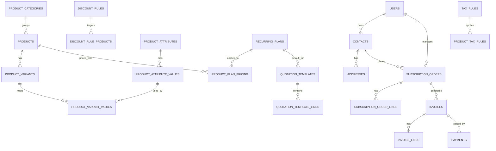
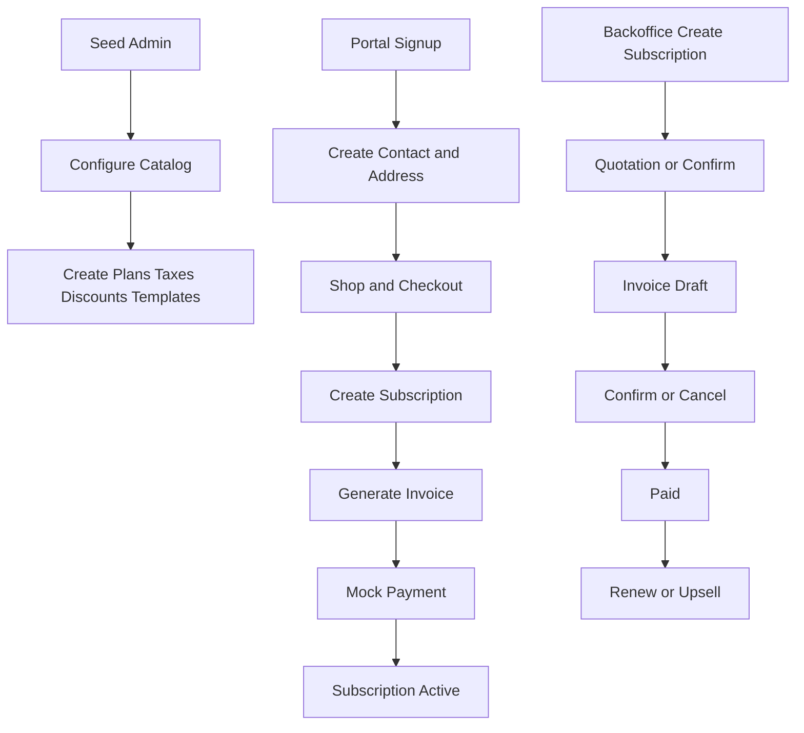

# Architecture

## Database Relationships

```mermaid
erDiagram
    USERS ||--o{ CONTACTS : owns
    CONTACTS ||--o{ ADDRESSES : has
    PRODUCT_CATEGORIES ||--o{ PRODUCTS : groups
    PRODUCTS ||--o{ PRODUCT_VARIANTS : has
    PRODUCT_ATTRIBUTES ||--o{ PRODUCT_ATTRIBUTE_VALUES : has
    PRODUCT_VARIANTS ||--o{ PRODUCT_VARIANT_VALUES : maps
    PRODUCT_ATTRIBUTE_VALUES ||--o{ PRODUCT_VARIANT_VALUES : used_by
    PRODUCTS ||--o{ PRODUCT_PLAN_PRICING : priced_with
    RECURRING_PLANS ||--o{ PRODUCT_PLAN_PRICING : applies_to
    RECURRING_PLANS ||--o{ QUOTATION_TEMPLATES : default_for
    QUOTATION_TEMPLATES ||--o{ QUOTATION_TEMPLATE_LINES : contains
    DISCOUNT_RULES ||--o{ DISCOUNT_RULE_PRODUCTS : targets
    TAX_RULES ||--o{ PRODUCT_TAX_RULES : applies
    CONTACTS ||--o{ SUBSCRIPTION_ORDERS : places
    USERS ||--o{ SUBSCRIPTION_ORDERS : manages
    SUBSCRIPTION_ORDERS ||--o{ SUBSCRIPTION_ORDER_LINES : has
    SUBSCRIPTION_ORDERS ||--o{ INVOICES : generates
    INVOICES ||--o{ INVOICE_LINES : has
    INVOICES ||--o{ PAYMENTS : settled_by
```

## Workflow

```mermaid
flowchart TD
    A[Seed Admin] --> B[Configure Catalog]
    B --> C[Create Plans Taxes Discounts Templates]
    D[Portal Signup] --> E[Create Contact and Address]
    E --> F[Shop and Checkout]
    F --> G[Create Subscription]
    G --> H[Generate Invoice]
    H --> I[Mock Payment]
    I --> J[Subscription Active]
    K[Backoffice Create Subscription] --> L[Quotation or Confirm]
    L --> M[Invoice Draft]
    M --> N[Confirm or Cancel]
    N --> O[Paid]
    O --> P[Renew or Upsell]
```
